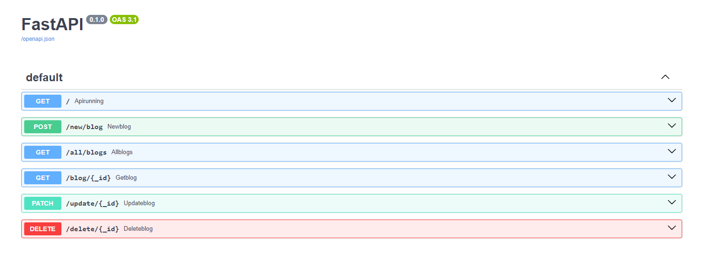

# FastAPI Blog Application

This is a simple blog application built with FastAPI and MongoDB Atlas. It allows users to perform CRUD (Create, Read, Update, Delete) operations on blog posts.

## Features

- Create a new blog post
- Read all blog posts
- Read a single blog post by ID
- Update a blog post by ID
- Delete a blog post by ID

## Requirements

- MongoDB Atlas account
- Docker

## Installation

1. Clone the repository:

    ```sh
    git clone https://github.com/yourusername/blogapi.git
    cd blogapi
    ```

2. Ensure you have Docker installed and running on your machine.

## Setup

1. Create a `.env` file in the project root directory with your MongoDB Atlas connection string:

    ```plaintext
    MONGODB_USER=username
    MONGODB_SECRET=password
    ```

## Building and Running the Docker Container

1. Build the Docker image:

    ```sh
    docker build -t blogapi .
    ```

2. Run the Docker container:

    ```sh
    docker run --env-file .env -d -p 8000:8000 --name blogapi-container blogapi
    ```

3. Verify that the application is running by navigating to `http://127.0.0.1:8000` in your web browser.

## Stopping and Removing the Docker Container

To stop the running container:

```sh
docker stop blogapi-container
    ```


## Example Backend Funcitonality
